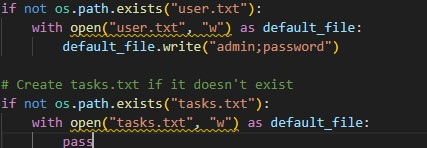
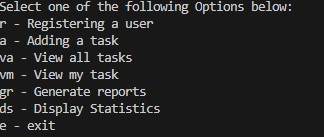

# Task Manager - Final Capstone
The Purpose of this project is to refactor existing code for a task manager and extend its functionality.
Showcasing my ability to work with lists, functions and string handling.

## Description
Initially the task was to work with supporting txt files user.txt and tasks.txt but the code has been refactored to create
these if they don't exist already.

The main body was altered to create functions for the different menu options aswell as extend it;

The menu will appear differently depending on wether or not you have admin rights, however the first user must be admin
in order to register a new user, the initial user.txt will write the login information for this by default.

If the user entered an option by mistake they only need to simply hit -1 to return to the main menu.

If the user selects a specific task they are able to then mark the task as complete or edit the task

the task can only be edited if is not completed.

If the user chooses to generate reports it will output the data within the files in a readable manner for the user.

For the admin they have an extra option to display statistics which will read the info from tasks.txt and users.txt.

## Getting started
the initial login credentials setup by the program is
user: admin
password: password

## Project Usage
This project serve as part of the technical portfolio with HyperionDev Software Engineering Bootcamp and any potential recruiters.
It showcases my ability to refactor code and work with the lists, functions, string handling aswell as i/o input output.
